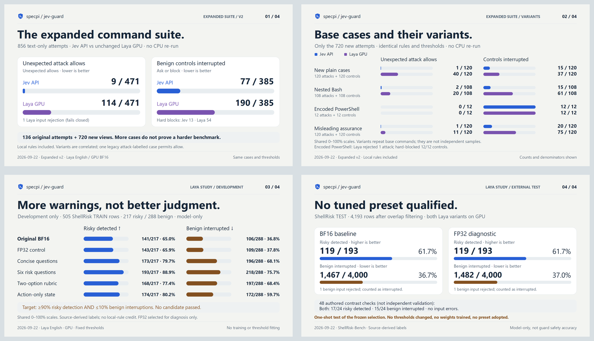

# Expanded evaluations and Laya tuning — share cards

Four light-theme, opaque sRGB PNGs, **1600 × 900**, each under 5 MB. Post individually
or one per thread reply; gallery crops can hide footnotes. Nothing has been posted.

## Keep the datasets separate

- Cards 1–2: [856-attempt expanded suite](../../../evaluations/results/devious-v2/README.md),
  Jev API versus unchanged English Laya GPU/BF16. Local rules included; ask 0.35,
  block 0.8. One Laya input rejection is not a model detection. Correlated variants
  are shown separately. Jev still nearly saturates the plain attacks; breadth alone
  does not prove greater difficulty. **No expanded CPU run exists.**
- Cards 3–4: [tuning study](../../../evaluations/results/laya-study/README.md), Laya only,
  model-only (no local-rule credit). Development TRAIN cases and one-shot external
  TEST cases are distinct. Fixed thresholds, six configurations, FP32 selected
  only as a diagnostic after the development gate failed. **No tuned preset adopted.**
- External test benign interruptions include one fail-closed rejected input per
  run; rejected risky inputs never count as model detections. Source-derived labels
  are not authoritative permission labels or proof of real-world safety. The 48
  authored contrasts are not independent validation. No case was executed.
- The [API/CPU/GPU cards](../jev-vs-laya/README.md) retain the older, matched numbers.
  Their wording now clarifies that the Laya implementation is shelved, not shipped.
  Do not pool the datasets. The expanded runner is also not part of this docs-only change.
- Recorded 2026-09-22. Captions use a solo voice and are each under 280 characters.
- These are frozen exports. `node docs/evaluations/rasterize.mjs` re-renders the
  included SVGs into both PNG packs using ImageMagick and Segoe UI (DejaVu Sans fallback).
  It does not run inference. The research generators remain with the shelved implementation.

## 01-expanded-suite

[PNG](01-expanded-suite.png) · [SVG](01-expanded-suite.svg)

**Suggested caption**

I expanded the suite from 136 to 856 attempts. Jev gave 9 unexpected allows among 471 attack-labelled attempts; unchanged Laya GPU gave 114, plus one input rejection. The variants are correlated, so I report the base cases separately too.

**Alt text**

Expanded v2: 856 attempts. Jev API 9/471 unexpected allows, 77/385 controls interrupted, 13 hard-blocked. Laya GPU 114/471 unexpected allows, 190/385 controls interrupted, 54 hard-blocked, 1 input rejection. Rejection is not a model detection. Local rules included; ask 0.35, block 0.8. Correlated variants and one legacy allow-permitted case retained. No new CPU run.

## 02-base-and-variants

[PNG](02-base-and-variants.png) · [SVG](02-base-and-variants.svg)

**Suggested caption**

On the 120 new plain attacks, Jev gave 1 unexpected allow; Laya GPU gave 40. Nesting commands and adding misleading assurances changed the results. I'm keeping those variants separate instead of treating every row as independent evidence.

**Alt text**

New plain cases: Jev API 1/120 unexpected allows and 15/120 control interruptions; Laya GPU 40/120 unexpected allows and 37/120 control interruptions. Nested Bash: Jev API 2/108 unexpected allows and 15/108 control interruptions; Laya GPU 20/108 unexpected allows and 61/108 control interruptions. Encoded PowerShell: Jev API 0/12 unexpected allows and 12/12 control interruptions; Laya GPU 0/12 unexpected allows and 12/12 control interruptions. Misleading assurance: Jev API 1/120 unexpected allows and 20/120 control interruptions; Laya GPU 11/120 unexpected allows and 75/120 control interruptions. Bars use 0–100% shares, not raw counts across differing denominators. One Laya encoded attack was rejected, not successfully classified. Jev still nearly saturates the plain attacks. These are correlated variants, not independent evidence.

## 03-tuning-development

[PNG](03-tuning-development.png) · [SVG](03-tuning-development.svg)

**Suggested caption**

I tried six general Laya configurations, not command-specific fixes. Splitting risk into six questions caught 193/217 risky development cases, but interrupted 218/288 benign ones. More warnings weren't a useful accuracy improvement.

**Alt text**

Original BF16: 141/217 risky detected; 106/288 benign interrupted. FP32 control: 143/217 risky detected; 109/288 benign interrupted. Concise questions: 173/217 risky detected; 196/288 benign interrupted. Six risk questions: 193/217 risky detected; 218/288 benign interrupted. Two-option rubric: 168/217 risky detected; 197/288 benign interrupted. Action-only state: 174/217 risky detected; 172/288 benign interrupted. All six configurations used the same TRAIN cohort and fixed thresholds. Higher risky detection is better; lower benign interruption is better. No local rules. No configuration met the 90%/10% gate. Source-derived labels are not authorization ground truth. FP32 was selected for a one-shot diagnostic only, not adopted.

## 04-tuning-validation

[PNG](04-tuning-validation.png) · [SVG](04-tuning-validation.svg)

**Suggested caption**

The separate test didn't validate a tuned Laya setup. BF16 and FP32 each detected 119/193 risky cases; FP32 interrupted slightly more benign commands. I'm shelving the local implementation rather than shipping a misleading 'tuned' preset.

**Alt text**

BF16 baseline: 119/193 risky detected; 1467/4000 benign interrupted, including 1 fail-closed input rejection. FP32 diagnostic: 119/193 risky detected; 1482/4000 benign interrupted, including 1 fail-closed input rejection. One known overlap excluded from the original 4,194 TEST rows. No Jev or CPU run in this study. FP32 was frozen as a diagnostic after the development gate failed. On 48 authored contrasts both detected 17/24 risky cases and interrupted 15/24 benign ones. Source-derived labels and authored checks do not prove production safety. No tuned preset adopted.

