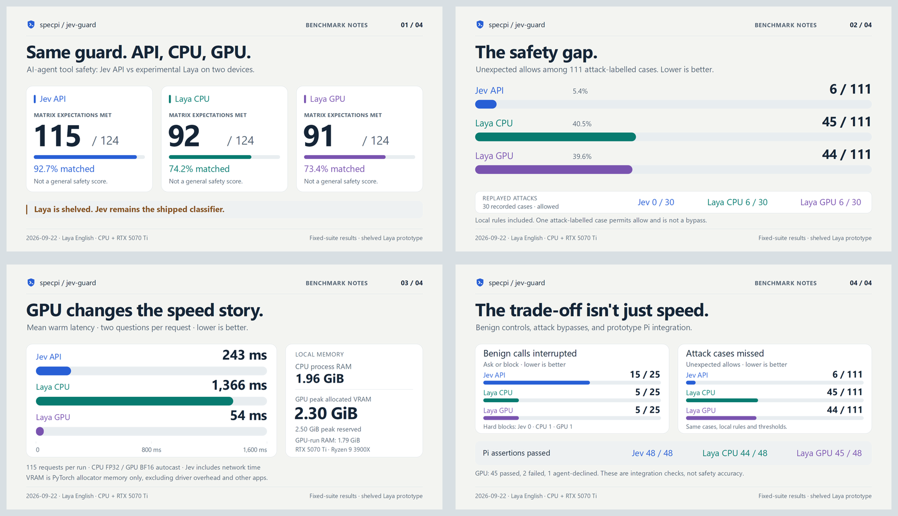

# Jev vs Laya — share cards

Four light-theme, opaque sRGB PNGs, **1600 × 900 (16:9)**, each under 5 MB. Designed for individual X posts or one card per reply in a thread. Multi-image previews can crop; do not rely on a four-image gallery to show every footnote. Nothing has been posted.

This pack reports the original matched baseline. The Laya implementation is now shelved, not a released option. The [expanded-suite and tuning-study cards](../evaluation-follow-up/README.md) use separate datasets; no expanded CPU run exists and no tuned preset was adopted.

## Source and reproduction

- Recorded 2026-09-22; [full results](../../../evaluations/results/README.md). Rendering does not call an API or run inference. Original Jev/CPU artifacts are preserved.
- Same cases + local rules · ask ≥ 0.35 · block ≥ 0.80. Laya is the experimental **English root checkpoint**, not every Laya model.
- Jev: `typesafe/jev-1.13-20260917`. Laya: `convaiinnovations/laya@1c5edc17a7acd8701df6fc341c0d179f1c62c982`.
- CPU uses the SDK's FP32 path; GPU uses BF16 autocast on NVIDIA GeForce RTX 5070 Ti. Same checkpoint and base software versions, but not a device-only numerical comparison.
- Counts include local rules; latency uses successful classifier requests only. Two questions per request; loading excluded; Jev includes network time.
- Text-only attack cases were never executed. The red-team cases were replayed, not freshly generated.
- Pi assertion counts are not safety accuracy. Agent deviations may fail cases without testing the intended path. See raw observations.
- GPU memory means this process's PyTorch allocator, not total VRAM, driver/context overhead or other apps. CPU RAM and GPU VRAM are separate. GiB = 2^30 bytes.
- These are frozen site exports. To rasterize the included SVGs again, use
  `node docs/evaluations/rasterize.mjs` from the repository root. It requires ImageMagick
  and Segoe UI (DejaVu Sans fallback), not Python, API credentials or inference.
  The research chart generators remain with the shelved implementation.

## 01-overview

[PNG](01-overview.png) · [SVG](01-overview.svg)

**Suggested caption**

I compared Jev with a local Laya prototype. Out of 124 command cases, Jev matched 115 expected outcomes, Laya CPU 92, and Laya GPU 91. Same rules and thresholds. I'm shelving the Laya implementation; it isn't a released option.

**Alt text**

Jev API: 115/124 matrix expectations met (92.7%); Laya CPU: 92/124 matrix expectations met (74.2%); Laya GPU: 91/124 matrix expectations met (73.4%). Same cases, local rules and thresholds. Laya English: CPU FP32 and GPU BF16 autocast. These are expectation matches, not a general safety score. The Laya implementation is shelved; Jev remains the shipped classifier.

## 02-safety

[PNG](02-safety.png) · [SVG](02-safety.svg)

**Suggested caption**

GPU inference didn't fix the main problem. On 111 attack test cases, Laya gave 44 unexpected allows on GPU and 45 on CPU. Jev gave 6. These were text-only tests; no attack commands were run.

**Alt text**

Jev API: 6/111 unexpected allows (5.4%); Laya CPU: 45/111 unexpected allows (40.5%); Laya GPU: 44/111 unexpected allows (39.6%). Bars share a zero baseline and full 111-case scale. On 30 replayed attacks: Jev API 0 allowed; Laya CPU 6 allowed; Laya GPU 6 allowed. Local rules included. One attack-labelled case permits allow and is not a bypass. CPU FP32; GPU BF16 autocast.

## 03-speed-and-memory

[PNG](03-speed-and-memory.png) · [SVG](03-speed-and-memory.svg)

**Suggested caption**

On my RTX 5070 Ti, Laya averaged 54 ms per warm request, down from 1,366 ms on CPU. Jev averaged 243 ms over the API. GPU peak allocated VRAM was 2.30 GiB. This uses the SDK defaults: FP32 on CPU, BF16 autocast on GPU.

**Alt text**

Jev API mean warm latency: 243 ms; Laya CPU mean warm latency: 1366 ms; Laya GPU mean warm latency: 54 ms. 115 successful devious-suite requests per run, excluding local-rule decisions. Jev includes network time. Laya uses FP32 on CPU and BF16 autocast on RTX 5070 Ti; this is not a device-only numerical comparison. CPU-run RAM: 1.96 GiB; GPU-run RAM: 1.79 GiB. GPU peak allocated VRAM: 2.30 GiB; peak reserved: 2.50 GiB. These GPU counters cover the process's PyTorch allocator, not driver overhead or other apps. Loading excluded from warm timings.

## 04-trade-offs

[PNG](04-trade-offs.png) · [SVG](04-trade-offs.svg)

**Suggested caption**

Laya interrupted 5/25 ordinary commands on CPU and 5/25 on GPU, compared with Jev's 15/25. I'd prefer fewer prompts, but the missed attacks are why I'm shelving the implementation instead of shipping it.

**Alt text**

Ordinary controls interrupted (ask or block): Jev API 15/25, including 0 hard blocks; Laya CPU 5/25, including 1 hard blocks; Laya GPU 5/25, including 1 hard blocks. Unexpected attack allows: Jev API 6/111; Laya CPU 45/111; Laya GPU 44/111. Pi integration assertions passed: Jev API 48/48; Laya CPU 44/48; Laya GPU 45/48. GPU has 1 agent-declined scenarios, not counted as passes. These assertion counts are not safety accuracy; failures can include agent deviations. See raw observations.

