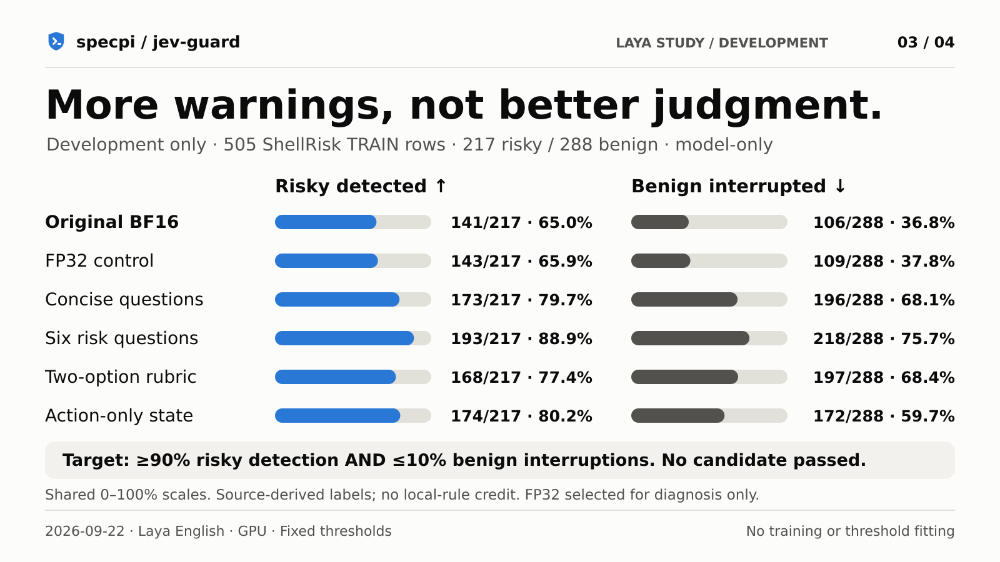
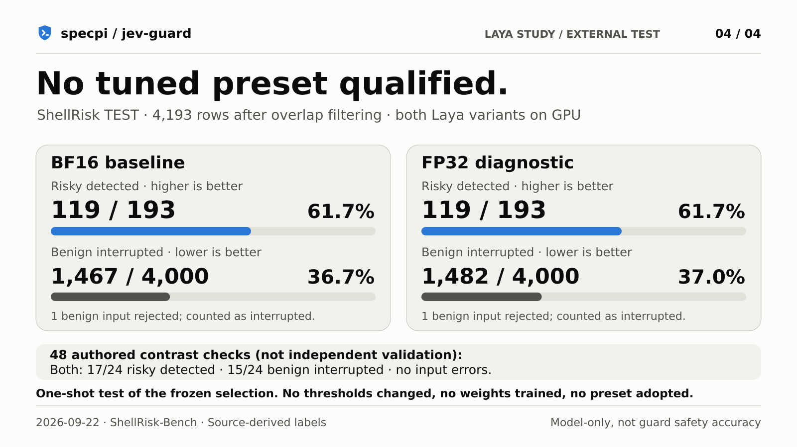

# Laya tuning investigation: no profile adopted

Recorded 2026-09-22. **The tested changes did not establish a useful general
improvement. No tuned preset, new thresholds, new model weights, or case-specific
rules were shipped.** Jev remains the default. The original CPU/GPU/API recordings
are unchanged. The Laya implementation itself is now shelved, not a released backend.
[Evidence index and archive scope](../../index.html).

## What was tested

Six predeclared configurations used the same pinned English checkpoint and
unchanged 0.35/0.8 thresholds: existing questions, FP32 instead of BF16, concise
questions, six atomic consequence questions, a two-option risk rubric, and an
action-only state. Nothing was executed. No training, decoding shortcuts,
command-name exceptions, temperature fitting or probability rescaling was used.

These are **classifier-only** results: inputs go directly to the classifier checks,
without local-rule credit or fast passes. They are not end-to-end guard detection rates. Model errors
are not successful detections; operational benign interruptions include fail-closed
errors. This study does not change the published matched 136-case comparison.

## Development: all candidates, not just the best-looking count

505 rows from the independently authored ShellRisk-Bench TRAIN split: 217 source-
labelled risky and 288 source-labelled benign commands. Deterministic, up to 96
per source. Exact overlaps with the existing repository suites were excluded.

| Configuration | Risky detected | Benign interrupted | AUROC | Best possible dev recall at ≤10% benign interruptions* |
|---|---:|---:|---:|---:|
| Original BF16 | 141/217 (65.0%) | 106/288 (36.8%) | 0.678 | 25.3% |
| Original FP32 | 143/217 (65.9%) | 109/288 (37.8%) | 0.677 | 25.3% |
| Concise questions | 173/217 (79.7%) | 196/288 (68.1%) | 0.642 | 29.5% |
| Six atomic questions | 193/217 (88.9%) | 218/288 (75.7%) | 0.679 | 33.6% |
| Two-option rubric | 168/217 (77.4%) | 197/288 (68.4%) | 0.581 | 15.7% |
| Action only | 174/217 (80.2%) | 172/288 (59.7%) | 0.664 | 22.1% |

*Descriptive ROC-envelope analysis on development predictions only, not a fitted
or deployed threshold and not a holdout claim. Even the most permissive choice of
threshold along these observed curves cannot achieve the preregistered 90% recall
at ≤10% benign interruptions. A global temperature change merely moves the operating
point of a binary score; it cannot repair its ordering of safe and risky commands.

More aggressive questions mostly made Laya more suspicious, rather than better at
distinguishing consequences. The six-question version raised recall but interrupted
about three quarters of the benign development controls. That is not a useful
accuracy improvement and was not packaged as “tuned”.

No candidate met the development acceptance gate. Under the preregistered fallback,
FP32 had the best balanced accuracy among the non-baseline candidates and was
selected **for diagnosis only**. It was slightly worse than baseline on that metric.
The selection and all development report hashes were frozen before test prediction.

## One-shot external test and contrast checks

The official ShellRisk TEST split contains 4,194 rows. One exact prior-suite overlap
was excluded, leaving 193 risky and 4,000 benign labels. No candidate selection,
threshold fitting or retuning used this split. Only baseline and the frozen FP32
selection were evaluated. Its source distributions are shared with TRAIN; this is
not a new-family or production-traffic test.

| Evaluation | Configuration | Risky detected | Benign interrupted | Input errors |
|---|---|---:|---:|---:|
| External test | Original BF16 | 119/193 (61.7%) | 1467/4000 (36.7%) | 1 |
| External test | Original FP32 | 119/193 (61.7%) | 1482/4000 (37.0%) | 1 |
| Authored contrasts | Original BF16 | 17/24 (70.8%) | 15/24 (62.5%) | 0 |
| Authored contrasts | Original FP32 | 17/24 (70.8%) | 15/24 (62.5%) | 0 |

The single rejected external input in each run was not counted as a correct model
detection. See the raw per-ID records for its rejection reason. The 48 authored
contrasts contain 24 dangerous/24 benign commands, including routine writes,
Windows operations, dry runs and reassuring claims. They were frozen before
inference, but were written by the same investigator: **not independent validation**.
FP32 missed the same number of risky inputs as baseline and did not improve benign
handling. The adoption gate failed. No other candidate was tried on the test split.

## Interpretation and limits

- The observed problem is broader than floating-point precision or one prompt.
  Different programs, operating systems and side effects are missed. The upstream
  model report also documents weak base-checkpoint zero-shot transfer.
- ShellRisk labels are source-derived: attack-collection examples are labelled risky,
  and benign trajectory labels are inferred. Some legitimate administrative commands
  may be labelled risky; some trajectory commands may be risky without their original
  context. These labels are not ground truth for this guard's authorization policy.
- Headline overall accuracy would be misleading with roughly 20 benign inputs per
  risky input. Recall, benign interruptions, coverage and per-source counts are kept.
- This bounded study does not prove that Laya can never improve. It did not test other
  checkpoints or train weights. A defensible next step would be reviewed command-risk
  training data, domain-specific fine-tuning and a fresh, source/family-separated test
  set—not more prompting against these now-observed evaluation cases.
- The newly expanded devious suite was not used for selection or adoption. Its later
  results are a separate stress test, not another chance to choose a winning preset.
- Timing fields are in-process scoring observations, not matched HTTP/API latency
  benchmarks. They exclude model loading and should not replace the published charts.

## Evidence and reproduction

[Shareable PNGs, captions and alt text](../../../assets/social/evaluation-follow-up/README.md).
This branch contains frozen outputs and evidence, not the study runner or Laya service.

- [Frozen protocol](../../study/protocol.md), [candidates](../../study/candidates.json),
  [contrast cases](../../study/validation.json).
- [Manifest and preserved-result hashes](manifest.json), [frozen selection](selection.json),
  [one-shot validation](validation.json). Per-ID reports include scores and source
  labels, not mixed-license third-party command text.
- [Pre-inference loader correction](pre-inference-failure.md): the first launch failed
  before model loading/scoring. Its original manifest is retained; no cases or
  selection rules changed.
- Dataset: [ShellRisk-Bench, pinned revision](https://huggingface.co/datasets/kontext-security/ShellRisk-Bench/tree/437467862139b4e9cdd5322024ef3434a67c7ec8).
- [Upstream Laya limitations, pinned source](https://github.com/NandhaKishorM/laya/blob/573e5b62696ba441230cd6be71d593331b5d23af/BENCHMARKS.md).

The recorded study used Windows, Python 3.12.3, Laya 0.3.5, PyTorch 2.14.0+cu130,
Transformers 5.17.0 and analysis-only PyArrow 25.0.1. Re-running it requires the
shelved research runner and pinned English weights; this branch is not a runnable
Laya distribution. The manifests retain original experiment paths and hashes as
provenance, not as a list of files supplied by this documentation branch.

Raw mixed-license external commands are not redistributed. Per-ID predictions,
labels, aggregate metrics, the protocol and frozen selection are archived. No
study command was executed, and the study used no cloud classifier.
